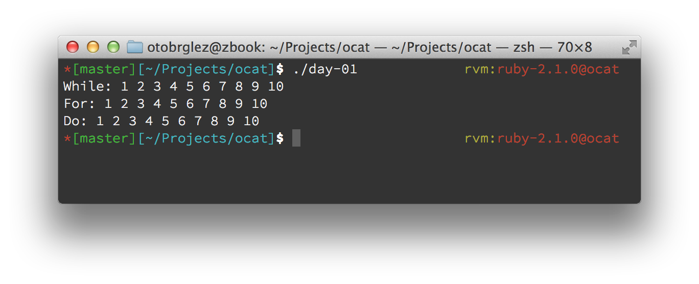
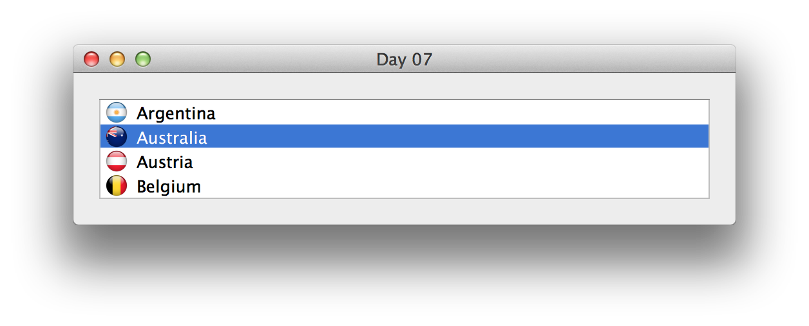

# Playing with Objective-C

Experiments with [Objective-C](https://developer.apple.com/library/mac/documentation/cocoa/conceptual/ProgrammingWithObjectiveC/Introduction/Introduction.html), [Cocoa](https://developer.apple.com/technologies/mac/cocoa.html), [Cocoa Touch](https://developer.apple.com/technologies/ios/cocoa-touch.html) and other Apple stuff.

Examples are organized by days, each "day" can be built from Makefile located on projects root folder. Instructions on building can be found underneeth section [building examples](#building-examples). There are some [pre-requirements](#requirements) to build them.

- [Oto Brglez](https://github.com/otobrglez)

## Examples

- [Day 01](src/01) - Simple Objective-C app with loops.

- [Day 02](src/02) - Interface, implementation, and simple class.
- [Day 03](src/03) - Pointers and some classes.
- [Day 04](src/04) - Classes, setters, getters, properties, categories and [LLDB][LLDB].
- [Day 05](src/05) - [CocoaPods](http://cocoapods.org/), XCode and [xctool](https://github.com/facebook/xctool).
- [Day 06](src/06) - Getting to know [NSTextView](), [NSButton][NSButton] and way to build UIs in XCode.
- [Day 07](src/07) - Introduction to [NSTableView][NSTableView] and [NSFileManager][NSFileManager]



## Requirements

- Ruby - with some VM like [RVM](https://rvm.io/)
- [xctool](https://github.com/facebook/xctool) - install it with [Homebrew](http://brew.sh/): ```brew install xctool```
- [CocoaPods](http://cocoapods.org/) - dependencies for each "day" are managed with [pods](http://guides.cocoapods.org/using/using-cocoapods.html) - install it with bundler: ```bundle install```

## Building examples

All code for can be build from command line.

```
make            # builds all examples

make day-01     # builds day-01
./day-01        # runs day-01

make run-06     # builds and runs day-06
make clean-06   # cleans everything that was build from day-06 code

make clean      # cleans everything
```

[NSTextView]: https://developer.apple.com/library/mac/documentation/Cocoa/Reference/ApplicationKit/Classes/NSTextView_Class/Reference/Reference.html
[NSButton]: https://developer.apple.com/library/mac/documentation/Cocoa/Reference/ApplicationKit/Classes/NSButton_Class/Reference/Reference.html
[NSFileManager]: https://developer.apple.com/library/mac/documentation/cocoa/reference/foundation/classes/nsfilemanager_class/reference/reference.html
[NSTableView]: https://developer.apple.com/library/mac/documentation/Cocoa/Reference/ApplicationKit/Classes/NSTableView_Class/Reference/Reference.html
[LLDB]: https://developer.apple.com/library/mac/documentation/IDEs/Conceptual/gdb_to_lldb_transition_guide/document/lldb-command-examples.html
